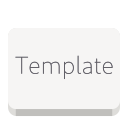

# Template [](https://github.com/konstantintutsch/C-Adw/actions/workflows/build.yaml)



Create GUI apps in C using LibAdwaita

To configure this template, run:

```xml
./template.sh
```

## Showcase


